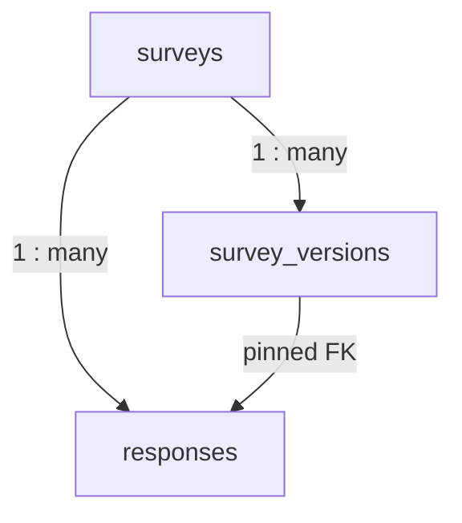
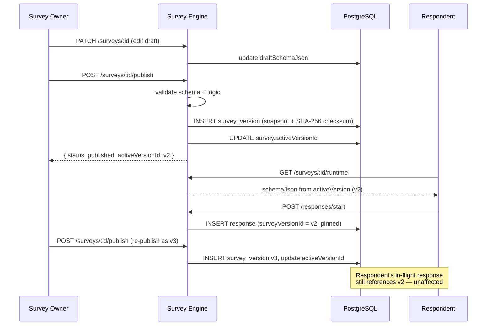

## Background

In working with SurveyJS on a potential change of course at Evolute, however, there was always one piece of functionality missing. SurveyJS did well what it needed to do: create form views and branch out based on logic, all done through JSON schemas and all inside the browser. The moment you got that submission, however, it was your responsibility.

Every single integration required similar capabilities: storage of schemas, versioning of said schemas so that editing a survey during submission doesn’t cause issues, partial save capability to let customers submit at a later time, analytics query generation, webhooks. While these may be individually simple, it's enough plumbing to turn it into its own project.

Survey Engine was made specifically for that purpose: a lightweight NestJS service that handled the data layer behind surveys without interfering with the backend in any way. This is the design process of this solution.

---

## Data Model

Three tables cover the entire domain.



### `surveys`

The mutable, owner-owned thing to be is the survey record. It contains:

- `draftSchemaJson` (JSONB) – the editable one in the SurveyJS Creator tool
- `draftLogicJson` (JSONB) – extra logic rules for visibility or calculating answers (optional)
- `settings` (JSONB) – additional runtime settings like webhooks configuration
- `activeVersionId` – FK to the published survey version
- `status` – enumeration `draft`, `published`, or `archived`
- `createdBy` – ID of the person who creates the record; taken from the auth provider of the deployment environment (nullable if there's no auth)

```typescript
@Entity('surveys')
@Index(['status'])
@Index(['createdAt'])
export class Survey {
  @PrimaryGeneratedColumn('uuid') id: string;
  @Column({ type: 'varchar', length: 255, nullable: true }) createdBy: string | null;
  @Column({ length: 255 }) name: string;
  @Column({ type: 'enum', enum: SurveyStatus, default: SurveyStatus.DRAFT }) status: SurveyStatus;
  @Column('uuid', { nullable: true }) activeVersionId: string | null;
  @Column('jsonb', { nullable: true }) draftSchemaJson: Record<string, unknown> | null;
  @Column('jsonb', { nullable: true }) draftLogicJson: Record<string, unknown> | null;
  @Column('jsonb', { default: { allowAnonymous: true, requireAuth: false } }) settings: SurveySettings;
  // ...
}
```

### `survey_versions`

Each publish operation makes a persistent snapshot row. The row contains a deep copy of the schema when published, a sequence `versionNumber`, and a schema’s SHA-256 digest.

```typescript
@Entity('survey_versions')
@Index(['surveyId', 'versionNumber'])
export class SurveyVersion {
  @PrimaryGeneratedColumn('uuid') id: string;
  @Column('uuid') surveyId: string;
  @Column('int') versionNumber: number;
  @Column('jsonb') schemaJson: Record<string, unknown>; // immutable snapshot
  @Column('jsonb', { nullable: true }) logicJson: Record<string, unknown> | null;
  @Column({ length: 64 }) checksum: string; // sha256 of schemaJson
  @Column({ default: false }) isDeprecated: boolean;
  @CreateDateColumn() createdAt: Date;
}
```

### `responses`

Row for each answer is formed by the respondent whenever he/she begins a survey and updated as the respondent moves forward in the process. It also maintains the value of `surveyVersionId`, which is important because version pinning requires immutability in FK value.

```typescript
@Entity('responses')
@Index(['surveyId', 'status'])
@Index(['surveyVersionId'])
export class Response {
  @PrimaryGeneratedColumn('uuid') id: string;
  @Column('uuid') surveyId: string;
  @Column('uuid') surveyVersionId: string; // pinned at start, never changed
  @Column({ type: 'varchar', length: 255, nullable: true }) respondentId: string | null;
  @Column('jsonb', { default: {} }) answersJson: Record<string, unknown>;
  @Column('jsonb', { default: {} }) metadata: Record<string, unknown>;
  @Column({ type: 'enum', enum: ResponseStatus }) status: ResponseStatus;
  @Column({ type: 'timestamp', nullable: true }) completedAt: Date | null;
}
```

`ResponseStatus` is `started | in_progress | completed | abandoned`.

---

## Versioning

The publish flow is the most important part of the service to get right.



This is the logic behind POST /surveys/:id/publish:

1. Read in the survey's draftSchemaJson
2. Verify that the structure is valid (requires pages[], certain types of elements, etc.)
3. If draftLogicJson exists, verify that it uses only question names found within the schema
4. Determine the latest versionNumber of this survey
5. Create a new SurveyVersion table entry with a deep-cloned snapshot and a SHA-256 hash of:
   ```typescript
   const checksum = createHash('sha256')
     .update(JSON.stringify(schema))
     .digest('hex');

   const version = this.versionRepository.create({
     surveyId: id,
     versionNumber: (latestVersion?.versionNumber ?? 0) + 1,
     schemaJson: JSON.parse(JSON.stringify(survey.draftSchemaJson)), // deep clone
     logicJson: survey.draftLogicJson ? JSON.parse(JSON.stringify(survey.draftLogicJson)) : null,
     publishedBy: ctx.userId || null,
     checksum,
   });
   ```
6. Change the field `surveys.activeVersionId` for the new survey version and change `status = published`.

When a participant enters the survey ("GET /surveys/:id/runtime"), then he receives a schema from `activeVersion`. During creating his own response, a response entry is created which has `surveyVersionId = activeVersionId`. The later changes in the draft won’t affect version entries. The participant will work with an old schema till completion of the survey.

---

## Response Lifecycle

Three endpoints handle the full lifecycle:

```
POST   /responses                  → creates row, status = started, fires webhook
PATCH  /responses/:id              → updates answersJson, status → in_progress
POST   /responses/:id/complete     → validates required fields, sets completedAt, fires webhook
```

All the heavy lifting is done by the `complete` endpoint. This endpoint loads the pinned-to version and performs the validation of `answersJson` against the validator. If required questions are not present, then rejection with field-specific errors occurs:

```typescript
async complete(ctx: RequestContext, id: string): Promise<Response> {
  const response = await this.findOne(ctx, id);
  const version = await this.versionRepository.findOne({ where: { id: response.surveyVersionId } });

  const validation = this.responseValidator.validate(
    version.schemaJson as unknown as SurveySchema,
    response.answersJson,
  );

  if (!validation.valid) {
    throw new BadRequestException({ message: 'Validation failed', errors: validation.errors });
  }

  response.status = ResponseStatus.COMPLETED;
  response.completedAt = new Date();
  const saved = await this.responseRepository.save(response);

  this.webhookService.fire(survey.settings, { event: 'response.completed', ... });
  return saved;
}
```

---

## Webhooks

Webhooks use the fire-and-forget model for their deliveries. Although the `fire()` function is invoked synchronously, the return value is never awaited, meaning it happens asynchronously without affecting the HTTP request that initiated the call.

```typescript
fire(settings: SurveySettings, payload: WebhookPayload): void {
  if (!settings.webhookUrl) return;

  const allowedEvents = settings.webhookEvents ?? DEFAULT_EVENTS;
  if (!allowedEvents.includes(payload.event)) return;

  // Intentionally not awaited — delivery is best-effort
  void this.deliver(settings.webhookUrl, payload, secret);
}
```

The `deliver` method retries up to 3 times with exponential backoff (1s, 2s, 4s) and aborts each attempt after 10 seconds:

```typescript
for (let attempt = 1; attempt <= MAX_RETRIES; attempt++) {
  const controller = new AbortController();
  const timer = setTimeout(() => controller.abort(), FETCH_TIMEOUT_MS); // 10s
  try {
    const res = await fetch(url, { method: 'POST', headers, body, signal: controller.signal });
    if (res.ok) return; // success
  } finally {
    clearTimeout(timer);
  }
  if (attempt < MAX_RETRIES) await sleep(BASE_DELAY_MS * 2 ** (attempt - 1)); // 1s, 2s, 4s
}
```

Every request has an HMAC-SHA256 signature included as part of the header information in `X-Survey-Engine-Signature: sha256=<hex>.` The key used for signing can either be per-survey in `settings.webhookSecret` or globally defined in the environment `WEBHOOK_SECRET`. The validation process is simple `

```typescript
import { createHmac, timingSafeEqual } from 'crypto';

function verifySignature(body: string, signature: string, secret: string): boolean {
  const expected = `sha256=${createHmac('sha256', secret).update(body).digest('hex')}`;
  return timingSafeEqual(Buffer.from(signature), Buffer.from(expected));
}
```

---

## Analytics

The analytics module works exclusively on the `responses` table employing PostgreSQL's aggregate functions. The structure is designed in three modules: `AggregationService` (summary statistics, funnel analysis, trends), `QuestionAnalyticsService` (per question statistics by employing response data), and `ExportService` (conversion to CSV). `AnalyticsService` is a thin layer over the other three.

**Summary** leverages `COUNT(*) FILTER (WHERE ...)` and `PERCENTILE_CONT` in one round trip query:

```sql
SELECT
  COUNT(*)::int                                                      AS total,
  COUNT(*) FILTER (WHERE status = 'completed')::int                 AS completed,
  AVG(EXTRACT(EPOCH FROM (completedAt - startedAt)))
    FILTER (WHERE status = 'completed' AND completedAt IS NOT NULL) AS avg_time,
  PERCENTILE_CONT(0.5) WITHIN GROUP
    (ORDER BY EXTRACT(EPOCH FROM (completedAt - startedAt)))        AS median_time
FROM responses
WHERE surveyId = $1
```

**Trends** groups by day and week using `DATE_TRUNC` and `TO_CHAR`:

```sql
SELECT
  TO_CHAR(startedAt, 'YYYY-MM-DD') AS date,
  COUNT(*)::int                     AS count,
  COUNT(*) FILTER (WHERE status = 'completed')::int AS completed
FROM responses
WHERE surveyId = $1
GROUP BY TO_CHAR(startedAt, 'YYYY-MM-DD')
ORDER BY date ASC
```

**Answer filtering** lets callers segment analytics by specific question answers. The `AnswerFilterDto` supports `eq`, `neq`, `contains`, `in`, `gt`, `lt`, `gte`, `lte` operators and maps to JSONB path queries:

```typescript
// EQUALS
qb.andWhere(`"r"."answersJson"->>:qid = :value`, { qid: filter.questionId, value: String(filter.value) });

// CONTAINS (text search)
qb.andWhere(`"r"."answersJson"->>:qid ILIKE :value`, { qid: filter.questionId, value: `%${filter.value}%` });

// GT (numeric cast)
qb.andWhere(`("r"."answersJson"->>:qid)::numeric > :value`, { qid: filter.questionId, value: Number(filter.value) });
```

---

## Identity Without Authentication

There’s no authentication layer for Survey Engine. The engine looks for `X-User-ID` in the request header and saves it as `createdBy` for surveys and `respondentId` for responses. The ownership verification logic runs if the user ID exists. That means the service compares the `createdBy` field of the resource and `userId` of the request. If those two IDs aren’t the same and both exist, the service returns `403 Forbidden`. If any of them is null, the ownership verification doesn’t run.

```typescript
private assertOwner(resource: { createdBy: string | null }, ctx: RequestContext): void {
  if (resource.createdBy && ctx.userId && resource.createdBy !== ctx.userId) {
    throw new ForbiddenException('You do not have access to this resource');
  }
}
```

Deployments that would like service-to-service authentication (like not having people accessing the survey engine directly via a browser) can enable the `API_KEY` security check. Add your `API_KEY` to your deployment environment variables, and each call will need to provide it in the header, either `Authorization: Bearer <key>` or `X-API-Key: <key>`.

---

## Module Structure

The service is split into feature modules with explicit imports. No global providers (except `ConfigModule`). The dependency graph looks like this:

```
AppModule
├── SurveysModule         (Survey entity, SurveysService, SurveyVersionsService)
│   └── SchemaModule      (SchemaValidatorService, LogicEngineService)
├── ResponsesModule       (Response entity, ResponsesService)
│   ├── SurveysModule
│   ├── SchemaModule
│   └── WebhooksModule
├── AnalyticsModule       (facade + AggregationService + QuestionAnalyticsService + ExportService)
│   ├── SurveysModule
│   └── ResponsesModule
└── WebhooksModule        (WebhookService)
```

`SurveysModule` exposes `SurveysService` and the `Survey`/`SurveyVersion` repositories for use in other modules without having to re-expose the entities. `SchemaModule` exposes both services for use in surveys when they are published and responses when they are completed.

---

## Testing

Integration tests use [Testcontainers](https://node.testcontainers.org/) to spin up a real PostgreSQL instance per test suite:

```typescript
beforeAll(async () => {
  container = await new PostgreSqlContainer('postgres:16-alpine')
    .withDatabase('survey_engine_test')
    .start();

  app = await Test.createTestingModule({ imports: [AppModule] })
    .overrideModule(TypeOrmModule)
    .useModule(TypeOrmModule.forRoot({
      type: 'postgres',
      url: container.getConnectionUri(),
      entities: [path.join(process.cwd(), 'src/**/*.entity{.ts,.js}')],
      synchronize: true,
    }))
    .compile();
}, 60_000);
```

This will enable you to run actual SQL queries and enforce actual constraints, not mocked repositories. The unit tests handle the logic in services, such as ownership validation, pagination calculations, analytics calculations, and web hook filtering, using Jest mocks.

---

## Deployment

The repo ships with a `docker-compose.yml` that runs the service and PostgreSQL together:

```yaml
services:
  survey-engine:
    build: .
    environment:
      DATABASE_URL: postgres://postgres:postgres@db:5432/survey_engine
      NODE_ENV: production
    ports:
      - "3000:3000"
    depends_on:
      db:
        condition: service_healthy

  db:
    image: postgres:16-alpine
    healthcheck:
      test: ["CMD-SHELL", "pg_isready -U postgres"]
```

When the service is started in production mode (`NODE_ENV=production`), `synchronize` is turned off, and the value of `migrationsRun` is set to `true`, thereby executing the migration scripts located in `src/database/migrations/`.

But when the service runs in development mode, `synchronize` is enabled, while migrations are bypassed.

However, be aware that when switching from development mode to production mode, if you initially started the service in development mode (which generated the schema using `synchronize`), the very first execution of migrations will try to execute the command `CREATE TYPE` on enums that have already been created.

---

## TypeScript SDK

The repo includes a typed SDK in `sdk/` that wraps all endpoints:

```typescript
const client = new SurveyEngineClient({
  baseUrl: 'https://surveys.your-domain.com',
  userId: req.user.id,  // your resolved user ID
  apiKey: process.env.SURVEY_ENGINE_API_KEY,  // optional
});

// All return types are fully typed
const survey = await client.surveys.create({ name: 'Onboarding', schemaJson: { ... } });
await client.surveys.publish(survey.id);

const response = await client.responses.start({ surveyId: survey.id });
await client.responses.update(response.id, { answersJson: { q1: 'answer' } });
await client.responses.complete(response.id);

const analytics = await client.surveys.getAnalytics(survey.id, { versionMode: 'combined' });
// analytics.summary.completionRate, analytics.questions[0].choices, etc.
```

The SDK is a local `file:../../sdk` dependency in the example. The plan is to publish it to npm as `@survey-engine/sdk` once the API is stable.

---

## What's Missing

There are a couple of things I chose not to include in v1:

**Webhook delivery logs** — delivery attempts are logged through Pino, but no logs exist for delivery history. When there's trouble delivering webhooks, you'd have to troubleshoot from the logs. Adding a `webhook_deliveries` table would solve this problem for v1.1.

**Response export** — you can use the API to query responses by filtering survey, status, date range, and answer values, but there's no `/export` endpoint where a dump in CSV or NDJSON format gets streamed back. The `ExportService` includes a `convertToCSV` method; it's just not hooked up to an HTTP endpoint yet.

**Survey access tokens** — the schema contains `settings.accessTokenRequired`, but the actual implementation is missing. This would enable some deployments to require an access token when inviting participants.

---

## Source

GitHub: [github.com/rezaenayati/survey-engine](https://github.com/rezaenayati/survey-engine)
Swagger UI: runs at `/api/docs` on any live instance
License: MIT

*Not affiliated with or endorsed by SurveyJS / Devsoft Baltic OÜ. "SurveyJS" is a trademark of Devsoft Baltic OÜ.*
