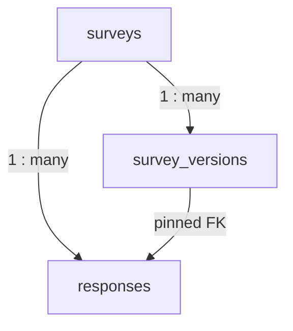
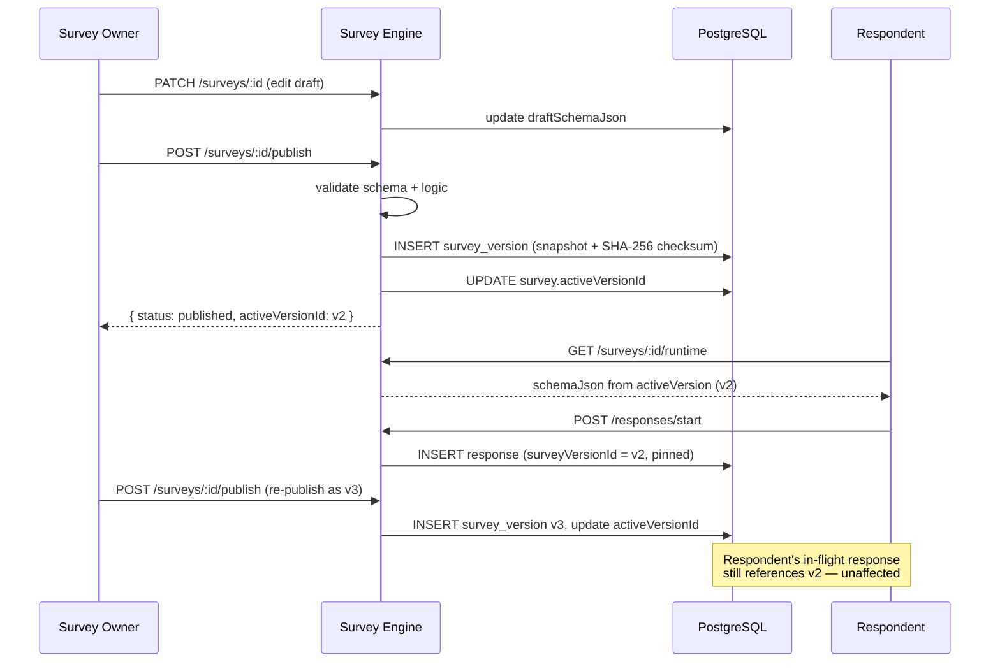

## Background

While evaluating SurveyJS for a new product at Evolute, one piece of the puzzle was always missing on our side. SurveyJS did well what it needed to do: render form views and branch on logic, all driven by JSON schemas, all inside the browser. The moment a submission came back, however, everything past that point was on you.

Every single integration required similar capabilities: storage of schemas, versioning of said schemas so that editing a survey during submission doesn’t cause issues, partial save capability to let customers submit at a later time, analytics query generation, webhooks. While these may be individually simple, it's enough plumbing to turn it into its own project.

Survey Engine was made specifically for that purpose: a lightweight NestJS service that handled the data layer behind surveys without interfering with the backend in any way. This is the design process of this solution.

---

## Data Model

Three tables cover the entire domain.



### `surveys`

The mutable, owner-owned thing to be is the survey record. It contains:

- `draftSchemaJson` (JSONB) – the editable one in the SurveyJS Creator tool
- `draftLogicJson` (JSONB) – extra logic rules for visibility or calculating answers (optional)
- `settings` (JSONB) – additional runtime settings like webhooks configuration
- `activeVersionId` – FK to the published survey version
- `status` – enumeration `draft`, `published`, or `archived`
- `createdBy` – ID of the person who creates the record; taken from the auth provider of the deployment environment (nullable if there's no auth)

```typescript
@Entity('surveys')
@Index(['status'])
@Index(['createdAt'])
export class Survey {
  @PrimaryGeneratedColumn('uuid') id: string;
  @Column({ type: 'varchar', length: 255, nullable: true }) createdBy: string | null;
  @Column({ length: 255 }) name: string;
  @Column({ type: 'enum', enum: SurveyStatus, default: SurveyStatus.DRAFT }) status: SurveyStatus;
  @Column('uuid', { nullable: true }) activeVersionId: string | null;
  @Column('jsonb', { nullable: true }) draftSchemaJson: Record<string, unknown> | null;
  @Column('jsonb', { nullable: true }) draftLogicJson: Record<string, unknown> | null;
  @Column('jsonb', { default: { allowAnonymous: true, requireAuth: false } }) settings: SurveySettings;
  // ...
}
```

### `survey_versions`

Each publish operation makes a persistent snapshot row. The row contains a deep copy of the schema when published, a sequence `versionNumber`, and a schema’s SHA-256 digest.

```typescript
@Entity('survey_versions')
@Index(['surveyId', 'versionNumber'])
export class SurveyVersion {
  @PrimaryGeneratedColumn('uuid') id: string;
  @Column('uuid') surveyId: string;
  @Column('int') versionNumber: number;
  @Column('jsonb') schemaJson: Record<string, unknown>; // immutable snapshot
  @Column('jsonb', { nullable: true }) logicJson: Record<string, unknown> | null;
  @Column({ length: 64 }) checksum: string; // sha256 of schemaJson
  @Column({ default: false }) isDeprecated: boolean;
  @CreateDateColumn() createdAt: Date;
}
```

### `responses`

Row for each answer is formed by the respondent whenever he/she begins a survey and updated as the respondent moves forward in the process. It also maintains the value of `surveyVersionId`, which is important because version pinning requires immutability in FK value.

```typescript
@Entity('responses')
@Index(['surveyId', 'status'])
@Index(['surveyVersionId'])
export class Response {
  @PrimaryGeneratedColumn('uuid') id: string;
  @Column('uuid') surveyId: string;
  @Column('uuid') surveyVersionId: string; // pinned at start, never changed
  @Column({ type: 'varchar', length: 255, nullable: true }) respondentId: string | null;
  @Column('jsonb', { default: {} }) answersJson: Record<string, unknown>;
  @Column('jsonb', { default: {} }) metadata: Record<string, unknown>;
  @Column({ type: 'enum', enum: ResponseStatus }) status: ResponseStatus;
  @Column({ type: 'timestamp', nullable: true }) completedAt: Date | null;
}
```

`ResponseStatus` is `started | in_progress | completed | abandoned`.

---

## Versioning

The publish flow is the most important part of the service to get right.



This is the logic behind POST /surveys/:id/publish:

1. Read in the survey's draftSchemaJson
2. Verify that the structure is valid (requires pages[], certain types of elements, etc.)
3. If draftLogicJson exists, verify that it uses only question names found within the schema
4. Determine the latest versionNumber of this survey
5. Create a new SurveyVersion table entry with a deep-cloned snapshot and a SHA-256 hash of:
   ```typescript
   const checksum = createHash('sha256')
     .update(JSON.stringify(schema))
     .digest('hex');

   const version = this.versionRepository.create({
     surveyId: id,
     versionNumber: (latestVersion?.versionNumber ?? 0) + 1,
     schemaJson: JSON.parse(JSON.stringify(survey.draftSchemaJson)), // deep clone
     logicJson: survey.draftLogicJson ? JSON.parse(JSON.stringify(survey.draftLogicJson)) : null,
     publishedBy: ctx.userId || null,
     checksum,
   });
   ```
6. Change the field `surveys.activeVersionId` for the new survey version and change `status = published`.

When a participant enters the survey ("GET /surveys/:id/runtime"), then he receives a schema from `activeVersion`. During creating his own response, a response entry is created which has `surveyVersionId = activeVersionId`. The later changes in the draft won’t affect version entries. The participant will work with an old schema till completion of the survey.

`POST /surveys/:id/duplicate` completes the list of functions that can be executed at the level of surveys. This call duplicates `draftSchemaJson`, `draftLogicJson`, and `settings`. In addition, a suffix `(copy)` is added to the name, and a new draft survey with zero versions and responses is generated. The copied survey is owned by the current user (or is anonymous in case there is no user id).

---

## Response Lifecycle

Three endpoints handle the full lifecycle:

```
POST   /responses                  → creates row, status = started, enqueues webhook
PATCH  /responses/:id              → updates answersJson, status → in_progress
POST   /responses/:id/complete     → validates required fields, sets completedAt, enqueues webhook
```

All the heavy lifting is done by the `complete` endpoint. It loads the pinned version, evaluates conditional logic against the current answers, and only validates the questions that logic considers visible — so a required question hidden by a `visibleIf` rule never blocks submission. If any visible required field is missing, the request is rejected with field-specific errors:

```typescript
async complete(ctx: RequestContext, id: string): Promise<Response> {
  const response = await this.findOne(ctx, id);
  this.assertRespondent(response, ctx);

  const version = await this.versionRepository.findOne({
    where: { id: response.surveyVersionId },
  });

  // Evaluate logic first so we know which questions are visible / required right now
  const logic = this.logicEngine.evaluateLogic(
    version.schemaJson as unknown as SurveySchema,
    version.logicJson as unknown as LogicSchema | null,
    response.answersJson,
  );

  const validation = this.responseValidator.validateResponse(
    version.schemaJson,
    response.answersJson,
    { validateRequired: true, partialValidation: false },
  );

  // Drop errors for questions that aren't visible under the current logic state
  const visibleErrors = validation.errors.filter((e) =>
    logic.visibleQuestions.includes(e.path.split('.')[0]),
  );
  const missingRequired = logic.requiredQuestions.filter((qId) => {
    const a = response.answersJson[qId];
    return a === undefined || a === null || a === '';
  });

  if (visibleErrors.length > 0 || missingRequired.length > 0) {
    throw new BadRequestException({
      code: ErrorCodes.VALIDATION_FAILED,
      message: 'Response validation failed',
      errors: visibleErrors,
      missingRequired,
    });
  }

  response.status = ResponseStatus.COMPLETED;
  response.completedAt = new Date();

  const survey = await this.surveysService.findOne(ctx, response.surveyId);

  // Commit completion + outbox row together — see the Webhooks section
  return this.dataSource.transaction(async (manager) => {
    const persisted = await manager.save(Response, response);
    await this.webhookService.enqueue(manager, survey.settings, {
      event: 'response.completed',
      timestamp: new Date().toISOString(),
      surveyId: persisted.surveyId,
      responseId: persisted.id,
      respondentId: persisted.respondentId,
      answersJson: persisted.answersJson,
    });
    return persisted;
  });
}
```

One interesting aspect of the logic engine is that string comparison using `EQUALS` and `CONTAINS` will be case-sensitive by default, meaning that `"Yes" === "yes"` will be evaluated to false, just like for `STARTS_WITH`, `ENDS_WITH`, and `MATCHES`. For those who were depending on case-insensitive comparisons in their surveys, it is possible to revert back to the old way with `logicJson.globalSettings.caseSensitiveStringComparison = false`.

---

## File Uploads

SurveyJS supports `file` questions, and the obvious thing — base64-encoding files into `answersJson` — falls apart almost immediately: response rows balloon, JSONB indexes become useless, and a 25 MB upload turns into a 33 MB row. Survey Engine handles file questions as a separate resource instead.

The lifecycle is two steps. The client uploads the file to `POST /files`, which streams the bytes to a configurable storage driver and writes an `uploaded_files` row with the file metadata and a `storageKey`. The response carries an `{ id, originalName, mimeType, size, url }` envelope that the client then drops into the corresponding file question's answer:

```typescript
const uploaded = await client.files.upload(file, {
  surveyId: survey.id,
  questionId: 'attachment',
  filename: file.name,
});

await client.responses.update(response.id, {
  answersJson: {
    attachment: {
      fileId: uploaded.id,
      originalName: uploaded.originalName,
      mimeType: uploaded.mimeType,
      size: uploaded.size,
      url: uploaded.url,
    },
  },
});
```

Storage is pluggable via a `FileStorage` interface. Three drivers ship in the box — `LocalFileStorage` (filesystem, default for dev), `S3FileStorage` (any S3-compatible bucket, including MinIO and R2 via `S3_ENDPOINT`), and `FirebaseFileStorage`. The driver is picked at boot from `FILE_STORAGE_DRIVER`:

```typescript
{
  provide: FILE_STORAGE,
  inject: [ConfigService],
  useFactory: (config: ConfigService) => {
    const driver = config.get<string>('FILE_STORAGE_DRIVER');
    if (driver === 's3') return new S3FileStorage(config);
    if (driver === 'firebase') return new FirebaseFileStorage(config);
    return new LocalFileStorage(config);
  },
}
```

When the upload call includes `surveyId` and `questionId`, the service loads the active version of that survey and applies the per-question rules baked into the schema — `allowedFileTypes` (MIME globs like `image/*` or extensions like `.pdf`) and `maxFileSize`. So the survey author can say "this question accepts images under 5 MB" right inside the SurveyJS JSON, and the engine enforces it on the server without the client needing to be trusted. Downloads go back through `GET /files/:id`, which streams from the same driver and applies the same ownership check used everywhere else.

---

## Webhooks

Webhooks use an outbox approach. The delivery is persisted in a `webhook_deliveries` table during the same transaction as when mutating the response’s state; then, it’s consumed by the worker in an asynchronous fashion. Committing both the outbox entry and response state mutation ensures at least one delivery; if there’s a failure between saving the response and posting the webhook, there will be a `PENDING` entry for the next worker tick.

The enqueue method requires the `EntityManager` instance from the caller’s context to commit the outbox entry within the same transaction as the response:

```typescript
async enqueue(
  manager: EntityManager,
  settings: SurveySettings,
  payload: WebhookPayload,
): Promise<void> {
  if (!settings.webhookUrl) return;
  const allowedEvents = settings.webhookEvents ?? DEFAULT_EVENTS;
  if (!allowedEvents.includes(payload.event)) return;

  const delivery = manager.create(WebhookDelivery, {
    event: payload.event,
    surveyId: payload.surveyId,
    responseId: payload.responseId,
    respondentId: payload.respondentId,
    url: settings.webhookUrl,
    secret: settings.webhookSecret ?? this.globalSecret ?? null,
    payload,
    status: WebhookDeliveryStatus.PENDING,
    attempts: 0,
    nextAttemptAt: new Date(),
  });
  await manager.save(WebhookDelivery, delivery);
}
```

The response handler wraps the save and the enqueue in one transaction:

```typescript
const completed = await this.dataSource.transaction(async (manager) => {
  const persisted = await manager.save(Response, response);
  await this.webhookService.enqueue(manager, survey.settings, {
    event: 'response.completed',
    timestamp: new Date().toISOString(),
    surveyId: persisted.surveyId,
    responseId: persisted.id,
    respondentId: persisted.respondentId,
    answersJson: persisted.answersJson,
  });
  return persisted;
});
```

The `WebhookDispatcherService` is timed using a configurable delay (@nestjs/schedule; default is 1 sec.). On each timeout, the service locks a batch of rows that are due to be dispatched using the `FOR UPDATE SKIP LOCKED` clause, meaning that the service can safely operate in parallel with other engines without duplicate POSTs of the same row;

```typescript
private async lockBatch(): Promise<string[]> {
  return this.dataSource.transaction(async (manager) => {
    const rows = await manager
      .createQueryBuilder(WebhookDelivery, 'd')
      .setLock('pessimistic_write')
      .setOnLocked('skip_locked')
      .where('d.status = :status', { status: WebhookDeliveryStatus.PENDING })
      .andWhere('d.nextAttemptAt <= :now', { now: new Date() })
      .orderBy('d.nextAttemptAt', 'ASC')
      .limit(this.batchSize)
      .getMany();
    return rows.map((r) => r.id);
  });
}
```

Because the locking transaction ends before the HTTP request, a slow `fetch` does not keep the row-level lock locked. Successful requests update `status = 'delivered'`. Failed ones increment `attempts`, save `lastError`, and schedule `nextAttemptAt = now + 2^(attempts - 1) seconds`—exponential backoff (1s, 2s, 4s) written to the database rather than stored in memory and timed out by a `setTimeout`. Once there have been `WEBHOOK_MAX_ATTEMPTS` consecutive failures (default 3), the status changes to `status = 'failed'` and the retries stop. The individual timeout remains 10 seconds and is enforced with `AbortController`.

Every single request is signed with `X-Survey-Engine-Signature: sha256=<hex>` computed on either the per-survey `settings.webhookSecret` or the global `WEBHOOK_SECRET` (which ever was saved in the row when enqueuing that delivery, making it possible to rotate secrets without breaking previously queued deliveries). The receiving side must do a separate length check on the signatures, because `timingSafeEqual` will throw if its arguments are of different lengths, and a caller can easily provide a short one.

```typescript
import { createHmac, timingSafeEqual } from 'crypto';

function verifySignature(body: string, signature: string, secret: string): boolean {
  const expected = `sha256=${createHmac('sha256', secret).update(body).digest('hex')}`;
  const a = Buffer.from(signature);
  const b = Buffer.from(expected);
  return a.length === b.length && timingSafeEqual(a, b);
}
```

The tunables reside below the environment variables: WEBHOOK_POLL_INTERVAL_MS (1000), WEBHOOK_MAX_ATTEMPTS (3), WEBHOOK_BATCH_SIZE (10), WEBHOOK_FETCH_TIMEOUT_MS (10000), and WEBHOOK_DISPATCHER_ENABLED (set to `false` if you want to continue writing outbox rows but drain using another process;

---

## Analytics

The analytics module works exclusively on the `responses` table, leaning on PostgreSQL's aggregate functions instead of pulling rows into Node and looping. It splits into three services: `AggregationService` (summary statistics, funnel analysis, trends), `QuestionAnalyticsService` (per-question stats), and `ExportService` (CSV conversion). `AnalyticsService` is a thin facade over the other three.

**Summary** is calculated using only three round-trip SQL queries, namely the main aggregate query fetching the total, finished, average time, and median time together; a status count `GROUP BY` query; and the query for "today / this week." In Postgres, the `FILTER` clause can be applied to the `PERCENTILE_CONT` ordered-set aggregate function, which means that the calculation of the median time can be done within the same SELECT statement as the counters and average time:

```sql
SELECT
  COUNT(*)::int                                                          AS total,
  COUNT(*) FILTER (WHERE status = 'completed')::int                      AS completed,
  AVG(EXTRACT(EPOCH FROM (completedAt - startedAt)))
    FILTER (WHERE status = 'completed' AND completedAt IS NOT NULL)      AS avg_time,
  PERCENTILE_CONT(0.5) WITHIN GROUP (ORDER BY EXTRACT(EPOCH FROM (completedAt - startedAt)))
    FILTER (WHERE status = 'completed' AND completedAt IS NOT NULL)      AS median_time
FROM responses
WHERE surveyId = $1
```

All searches for `ResponseStatus` use bound variables (`:statusCompleted`, `:statusStarted`, and so forth), instead of string interpolation; thus, the enumerated values get validated by the driver, and adding another status value won’t provide any foothold for SQL injection attacks.

**Trends** groups by day and week using `DATE_TRUNC` and `TO_CHAR`:

```sql
SELECT
  TO_CHAR(startedAt, 'YYYY-MM-DD') AS date,
  COUNT(*)::int                     AS count,
  COUNT(*) FILTER (WHERE status = 'completed')::int AS completed
FROM responses
WHERE surveyId = $1
GROUP BY TO_CHAR(startedAt, 'YYYY-MM-DD')
ORDER BY date ASC
```

**Answer filtering** lets callers segment analytics by specific question answers. The `AnswerFilterDto` supports `eq`, `neq`, `contains`, `in`, `gt`, `lt`, `gte`, `lte` operators and maps to JSONB path queries:

```typescript
// EQUALS
qb.andWhere(`"r"."answersJson"->>:qid = :value`, { qid: filter.questionId, value: String(filter.value) });

// CONTAINS (text search)
qb.andWhere(`"r"."answersJson"->>:qid ILIKE :value`, { qid: filter.questionId, value: `%${filter.value}%` });

// GT (numeric cast)
qb.andWhere(`("r"."answersJson"->>:qid)::numeric > :value`, { qid: filter.questionId, value: Number(filter.value) });
```

---

## Identity and trust

Survey Engine does not come bundled with an identity provider; you must authenticate the client yourself before forwarding their user ID. Four methods exist for doing so, ranging from the least to most trusted by Survey Engine regarding the validity of the claimed user ID.

**Trusted gateway (default)**. The engine takes the value of `X-User-ID` in the request header, storing it under `createdBy` in the survey and `respondentId` in the response. Because there is no verification of authenticity, this is only recommended if there is a trusted layer outside of the engine, e.g., your own gateway, and the engine is only accessible via said gateway. Anything that can access the port may claim any value for `X-User-ID`.

**API key**. If `API_KEY` is defined, it becomes necessary for all requests (excluding the health check) to include a bearer API key in either the `Authorization` or `X-API-Key` header.

**Strict auth.** Enabling `STRICT_AUTH` together with `API_KEY` closes the possibility of "anonymously calling `X-User-ID:` and then being that user": both `X-User-ID` checks and the presence of `API_KEY` should succeed, and any mutation operations on anonymous resources aren't allowed. In case of a faulty deployment setup, the service will fail closed rather than silently allowing attackers to authenticate as legitimate users.

**User-signed tokens.** Providing `USER_TOKEN_SECRET` causes the engine to validate an HS256-signed JWT passed in `X-User-Token` whose subject claim corresponds to the user ID. This allows us to delegate validation to the engine, which now doesn't have to rely on the caller's identity claim but can verify the token's cryptographic signature directly. When combined with `STRICT_AUTH`, plain `X-User-ID` authentication is completely disallowed.

In order to separate concerns, the former functionality is encapsulated in `ApiKeyGuard`, while the latter in `UserAuthGuard`. Both guards respond to `@SkipApiKey` decorator, but skip health checks. `GetContext` takes precedence over `X-User-ID` whenever there is a validated token and `verifiedUserId` property is set on a successfull authorization attempt.

After resolving identity, any mutation calls follow hybrid ownership rules. For identified assets (`createdBy` is set), it’s a perfect match; anonymous assets (`createdBy` is null) can be mutated by anyone, until `STRICT_AUTH` changes that also:

```typescript
assertOwner(survey: Survey, ctx: RequestContext): void {
  if (survey.createdBy) {
    if (!ctx.userId || survey.createdBy !== ctx.userId) {
      throw new ForbiddenException({
        code: ErrorCodes.FORBIDDEN,
        message: 'You do not have access to this survey',
      });
    }
    return;
  }
  if (this.strictAuth) {
    throw new ForbiddenException({
      code: ErrorCodes.STRICT_AUTH_VIOLATION,
      message: 'Mutating anonymous surveys is disabled in strict mode',
    });
  }
}
```

That shape persists in `ResponsesService.assertRespondent` with respect to `respondentId`. The older "if both IDs are there and not equal, return 403; else proceed" approach allowed an anonymous caller to modify a resource belonging to a user — the hybrid approach rectifies this without compromising the anonymous-resource paradigm upon which the no-auth deployment model depends.

`GET /surveys/:id` is wrapped in an extra visibility check on top of ownership: drafts and archived surveys are visible only to their owner, and a non-owner asking for someone else's draft gets a `404` — same response as a non-existent ID, so the endpoint can't be used to enumerate draft UUIDs.

---

## Error codes

The response body for each error contains a machine-parsable `code`, in addition to `statusCode` and `message`. Instead of the earlier "substring-matching" `deriveCode` tower that would attempt to guess the type of error based on its English description, an `ErrorCodes` registry (`SURVEY_NOT_FOUND`, `RESPONSE_ALREADY_COMPLETED`, `FORBIDDEN`, `INVALID_SCHEMA`, `INVALID_USER_TOKEN`, `STRICT_AUTH_VIOLATION`, `FILE_TOO_LARGE`, `FILE_TYPE_NOT_ALLOWED`, `RATE_LIMITED`, and many more) provides a single source of truth. Clients can switch on the code without having to parse any text, and this is exposed by the SDK via `SurveyEngineError.code`. There is also a `codeForStatus(status)` fallback for uncodeed exceptions thrown out of the box.

---

## Module Structure

The service is split into feature modules with explicit imports. No global providers (except `ConfigModule`). The dependency graph looks like this:

```
AppModule
├── SurveysModule         (Survey entity, SurveysService, SurveyVersionsService)
│   └── SchemaModule      (SchemaValidatorService, LogicEngineService)
├── ResponsesModule       (Response entity, ResponsesService)
│   ├── SurveysModule
│   ├── SchemaModule
│   └── WebhooksModule
├── FilesModule           (UploadedFile entity, FilesService, pluggable storage driver)
│   └── SurveysModule
├── AnalyticsModule       (facade + AggregationService + QuestionAnalyticsService + ExportService)
│   ├── SurveysModule
│   └── ResponsesModule
├── WebhooksModule        (WebhookDelivery entity, WebhookService, WebhookDispatcherService)
└── HealthModule          (liveness + DB-readiness probes)
```

`SurveysModule` exposes `SurveysService` and the `Survey`/`SurveyVersion` repositories for use in other modules without having to re-expose the entities. `SchemaModule` exposes both services for use in surveys when they are published and responses when they are completed.

---

## Testing

Integration tests use [Testcontainers](https://node.testcontainers.org/) to spin up a real PostgreSQL instance per suite, then build a `DataSource` against it. The helper that the integration suites share:

```typescript
export async function startTestDatabase() {
  container = await new PostgreSqlContainer('postgres:16-alpine')
    .withDatabase('survey_engine_test')
    .withUsername('test')
    .withPassword('test')
    .start();

  dataSource = new DataSource({
    type: 'postgres',
    host: container.getHost(),
    port: container.getPort(),
    username: container.getUsername(),
    password: container.getPassword(),
    database: container.getDatabase(),
    entities: [Survey, SurveyVersion, Response],
    synchronize: true,
    logging: false,
  });

  await dataSource.initialize();
  return { /* connection info handed to the Nest TestingModule */ };
}
```

This will enable you to run actual SQL queries and enforce actual constraints, not mocked repositories. The unit tests handle the logic in services, such as ownership validation, pagination calculations, analytics calculations, and web hook filtering, using Jest mocks.

---

## Deployment

The repo ships with a `docker-compose.yml` that runs the service and PostgreSQL together:

```yaml
services:
  postgres:
    image: postgres:16-alpine
    environment:
      POSTGRES_USER: postgres
      POSTGRES_PASSWORD: postgres
      POSTGRES_DB: survey_engine
    healthcheck:
      test: ["CMD-SHELL", "pg_isready -U postgres"]

  survey-engine:
    build: { context: ., dockerfile: Dockerfile }
    environment:
      NODE_ENV: production
      DB_HOST: postgres
      DB_PORT: 5432
      DB_USER: postgres
      DB_PASSWORD: postgres
      DB_NAME: survey_engine
      DB_SYNCHRONIZE: "false"  # explicit opt-in; migrations run on startup
    ports:
      - "3000:3000"
    depends_on:
      postgres:
        condition: service_healthy
```

Schema management is explicit: if `DB_SYNCHRONIZE=true`, use TypeORM’s `synchronize` (auto-schema synchronization via entities). Else, all migration scripts under `src/database/migrations/` will be executed at startup. Environment variable `NODE_ENV` is no longer involved in this process; it now influences log verbosity only. Old-fashioned approach was `synchronize: NODE_ENV !== 'production'`, which caused all other possible values for `NODE_ENV` to trigger automatic schema syncing with an actual database – an unwanted situation we got rid of by requiring an opt-in. `.env` file for local development contains `DB_SYNCHRONIZE=true`.

But the CREATE TYPE gotcha definitely is worth mentioning. If you've been working with your application in `DB_SYNCHRONIZE=true` mode and you bootstrapped your database with some pre-existing enums, but you switch to migrations, then the very first migration attempt will fail because the types are going to be created twice. Possible solutions would be to use a fresh database or remove the pre-existing enums manually.

Each reply will have an `X-Request-ID` header. The middleware parses it once per each request by either using the incoming `X-Correlation-ID` header that the caller may provide (which means you’ll be able to correlate requests not only through the gateway and engine but also your services) or by parsing a randomly generated UUID. The parsed value becomes the truth going forward: logs, errors, and `RequestContext` will all take the value from this one place.

---

## TypeScript SDK

The repo includes a typed SDK in `sdk/` that wraps all endpoints:

```typescript
const client = new SurveyEngineClient({
  baseUrl: 'https://surveys.your-domain.com',
  userId: req.user.id,                              // sent as X-User-ID
  userToken: mintHs256Jwt({ sub: req.user.id }),    // optional; sent as X-User-Token
  apiKey: process.env.SURVEY_ENGINE_API_KEY,        // optional
});

// All return types are fully typed
const survey = await client.surveys.create({ name: 'Onboarding', schemaJson: { ... } });
await client.surveys.publish(survey.id);

const response = await client.responses.start({ surveyId: survey.id });
await client.responses.update(response.id, { answersJson: { q1: 'answer' } });
await client.responses.complete(response.id);

const analytics = await client.surveys.getAnalytics(survey.id, { versionMode: 'combined' });
// analytics.summary.completionRate, analytics.questions[0].choices, etc.
```

The SDK is published on npm as [`survey-engine-sdk`](https://www.npmjs.com/package/survey-engine-sdk) — `npm install survey-engine-sdk` and the types come with it. The example app in this repo links it via `file:../../sdk` during development so SDK changes show up without a publish cycle.

---

## What's Missing

There are a couple of things I'm holding for the next horizon:

**A read endpoint for webhook deliveries** – all webhook deliveries are now stored in `webhook_deliveries` table with `attempts`, `last_response_status`, and `last_error`, so all the info you need is available. What is missing here is a `GET /webhook-deliveries` endpoint (filtered by survey, response, and status) exposing rows through the API. At the moment, you have no choice but to access the table directly via DB queries.

**Survey access tokens** — the schema contains `settings.accessTokenRequired`, but the actual implementation is missing. This would enable some deployments to require an access token when inviting participants.

---

## Source

GitHub: [github.com/rezaenayati/survey-engine](https://github.com/rezaenayati/survey-engine)
Swagger UI: runs at `/api/docs` on any live instance
License: MIT

*Not affiliated with or endorsed by SurveyJS / Devsoft Baltic OÜ. "SurveyJS" is a trademark of Devsoft Baltic OÜ.*
